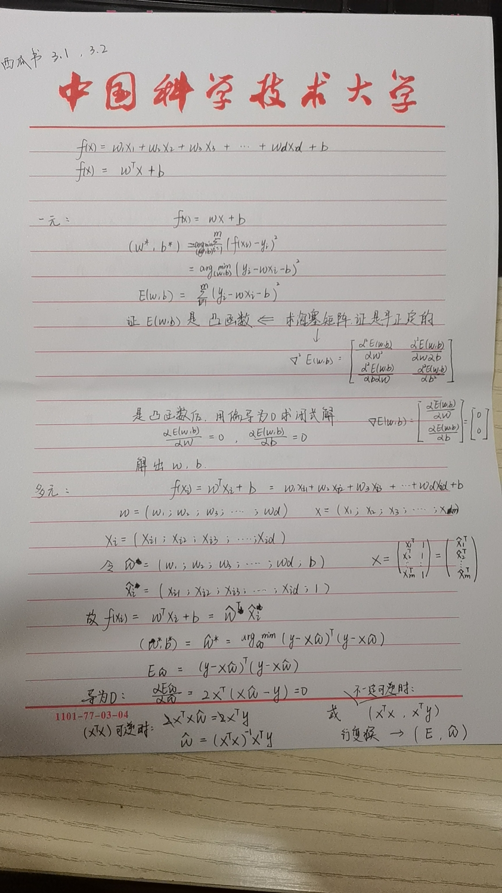
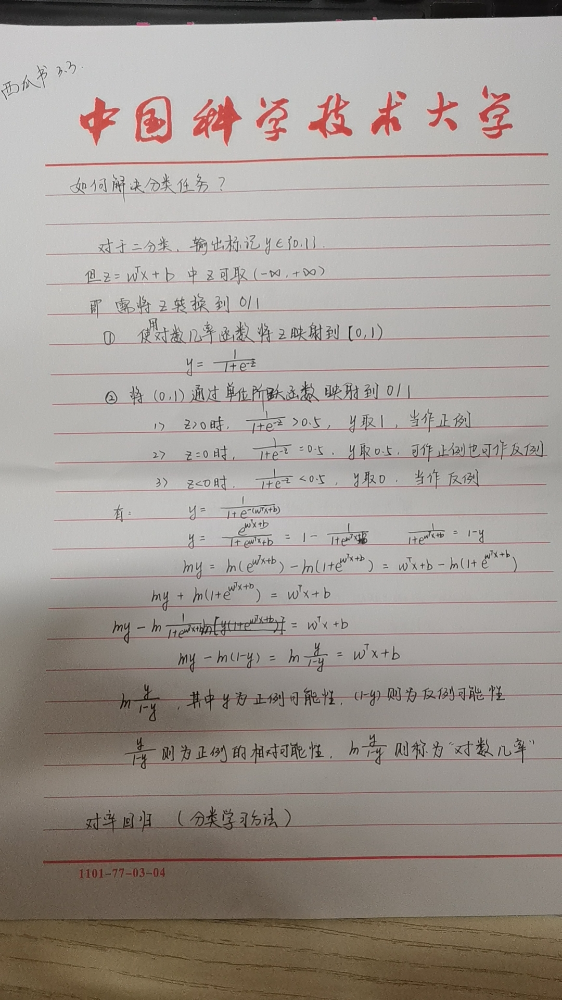
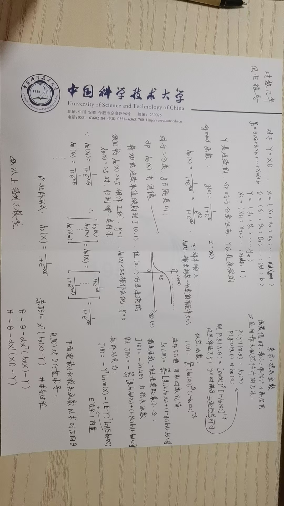

# 吃瓜笔记

## 第一章	绪论

绪论开篇介绍了一些重要的术语概念：

1. 样本（示例），行向量，列向量，样本空间；
2. 数据集，训练集，测试集，训练，测试，模型，假设，真相；
3. 标记，标记空间；
4. 泛化，分布；
5. 分类，回归，聚类；
6. 监督学习，无监督学习；
7. 假设空间，版本空间，归纳偏好

在学习过程中，很多概念在经过西瓜书和南瓜书形象的解释后很容易理解；


从假设空间内容开始的展开容易让人产生较深的印象：

1. 对于训练集，因其有限性，都可能会有不同的假设是符合的，这就称为是不同的假设空间；不同假设空间的集合就是版本空间；		但是，有那么多假设空间，对于非训练集样本的预测往往不同，那么就会产生一个问题：在进行测试时，应该用哪个呢？		接着这个问题，随后引出了归纳偏好的必要性以及对NFL原理的论证。
2. 既然不同假设空间所产生的预测可能不同，那么我们在进行预测时应该具体问题具体分析，鱼与熊掌不可兼得，但是我们应该选择我们更需要的那个；         在选择假设空间问题中有一个“奥卡姆剃刀”原则，它偏向更简单的假设空间，这其实并不是很好的答案，一者它似乎与具体问题没有关联，二者有时很难定义何为“简单”。
3. 式1.1，1.2推导出一个令人不解的答案：总误差与学习算法没有关系；这与常人思想中的“越好越精密的东西越厉害”不同。这就是NFL（天下没有免费午餐）定理。但这是在基于“问题”出现几率相同，重要程度相同的基础上。幸运的是，我们想要解决的问题往往不符合上面的定义，不同问题出现的几率不同，重要程度也不同，即我们需要找到最能解决我们需求的那个算法。


绪论后面介绍了机器学习等领域在人类社会发展，人们生活中的重要性。有些是我们正在亲历的，有些还亟待发展，相信这个领域会继续发光，也带来一些学习的动力吧。

------


## 第二章

### 2.1 经验误差与过拟合

概念：

1. 错误率，精度		精度=1-错误率
2. 误差，经验误差，泛化误差
3. 过拟合，欠拟合

过拟合：学习能力相比于数据太强也不是一件好事，如果学习器在训练集中挖掘过深，就可能把训练集中的很多特点找出，认为这是预测真相的一些规律。然而，这些特点可能并不适用于潜在样本，因此可能造成泛化误差反而变大的结果，这就是过拟合。

欠拟合：相对于过拟合，欠拟合就是寻常理解的功夫不到位导致的误差大。

由于过拟合现象的存在，并且是不可避免的。因此成为了机器学习很多地方的关键障碍。

一个任务，可以选择多种算法；一个算法，可以选择多种参数配置；这造成了模型的选择多样，如何选择到最适合的呢？这就是模型的选择问题。关于这个问题，观察误差大小似乎可以评价模型的好坏，然而，无论是泛化误差还是训练误差都有它适合作为现实评价的理由：

1. 对于泛化误差：我们无法得到泛化误差
2. 对于训练误差：由于可能存在过拟合现象，训练误差的大小难以推理出泛化误差的大小

由此引出第二节介绍评估方法。

------


### 2.2评估方法

上节中的主要问题在于，泛化误差难以获取。所以采取这样一种方法：

找到一个”测试集“来测试训练得到的学习器，根据在这个测试集上的测试误差来作为泛化误差的近似；这里通常要有两个原则：

1. 测试集应该尽可能的与训练集互斥，即测试集中的样本不作为训练过程的材料
2. 测试集的样本理应也是独立同分布采样而得，以让其测试误差具有能够近似泛化误差的条件

一般在任务中，样本数据只有那么多，只能将样本进行划分，划分为训练集和测试集；如何对总的数据集进行划分，这里介绍了几种方法：

1. 留出法：即留出一部分样本作为测试集不参与训练，测试集与训练集在分布上应尽可能一致（保留类别比例）；如何留出这部分样本仍有很多种方法，如从1000个样本中留出300个，留下哪300个还是有很多组合方法；所以一般采用若干此留出法最后取平均值。（为保证训练集或是测试集不过少，一般取一个折中的比例，以2/3到4/5的样本做训练）
2. 交叉验证法：交叉验证法相比留出法的不同是，按照分层采样将数据集分为k个子集，在一次交叉验证法中，分别以各个子集作为测试集，其他子集作为训练集，可以得到k组测试结果，也叫k折交叉验证；即使是这样，从数据集划分为k个子集的过程中依旧有很多种组合方法，与留出法类似，也应进行若干次k折验证法最后取平均值。
3. 留一法：交叉验证法的特例，有多少样本就分为多少子集，也就会在一次方法中产生多少次训练和测试，这个开销是巨大的，而且最后的结果也不一定理想。
4. 自助法：上面的方法都减小了数据集的规模，训练集不足会导致一些偏差。这里采用放回抽取的方法，从数据集中抽样本再放回，直到抽出的样本数与原数据集一样大，根据计算，样本不被抽取的概率约为36.8%，保证了训练集与测试集的互斥。但是样本的重复抽取会改变训练集相比原数据集的分布，这是会产生偏差的。

上面，我们把划分出的部分叫做测试集，但是，实际使用学习器时遇到的数据也是在对学习器进行测试，这里，我们把上面从数据集划分出来的测试集叫做验证集，相应的测试过程也叫做验证。

因此现在我们就有了数据集（划分为训练集，验证集）作为得到模型的材料，有模型得到后进行评估测试的测试集。

其实这里的测试集一般还是要我们提前留出的，关系可以见下：


我们利用最后的训练集训练模型，使用验证集来检验不同算法，不同参数配置时模型的好坏，选择到最好的一组后。使用测试集来对模型进行检验，估测测试误差（近似泛化误差）来评估模型。

------

### 2.3性能度量

概念：

1. 均方误差，错误率，精度
2. 查准率，查全率，分类结果混淆矩阵
3. P-R曲线，P-R图，BEP，F1，Fβ
4. 宏查准率，宏查全率，宏F1；微查准率，微查全率，微F1
5. 分类阈值，ROC曲线；TPR，FPR，TNR，FNR；AUC，损失
6. 代价矩阵，代价曲线，归一化代价

对于P-R，ROC，代价，可以理解后自己举例，画图描点连线画一画

2.3-后，有点不太想看了，浏览了一遍，后续重新学习时再补充

[^两节内容补充]: 2.4，2.5部分内容后续补充

[南瓜书学习教程网站主页]: https://www.datawhale.cn/home

[^西瓜书]: 西瓜书就是周志华老师的《机器学习》

------

## 第三章

推导简要记录：






线性回归代码实现相关内容：

```python
#导包
import matplotlib.pyplot as plt
import pandas as pd
import numpy as np
from sklearn import datasets,linear_model

#读csv文件获取数据
data=pd.read_csv('Folds5x2_pp.csv')

#数据展示
data.head()
data.shape

#构建与展示示例集
X = data[['AT', 'V', 'AP', 'RH']]
X.head()

#构建与展示标记集
y=data[['PE']]
y.head()

#调用划分函数划分数据集为训练集和测试集
from sklearn.model_selection import train_test_split
X_train,X_test, y_train, y_test = train_test_split(X, y, random_state=1)

#查看划分情况，发现函数默认按照3：1进行划分
print(X_train.shape)
print(y_train.shape)
print(X_test.shape)
print(y_test.shape)

#直接调用线性回归模型进行训练和求解
from sklearn.linear_model import LinearRegression
linreg=LinearRegression()
linreg.fit(X_train,y_train)

#查看参数结果
print(linreg.coef_)			#系数
print(linreg.intercept_)	#常数项


'''对一些刚了解函数的补充
1. train_test_split
train_test_split(train_data,train_target,test_size,random_state,shuffle)
train_data:还未划分的数据集
train_target:还未划分的标记
test_size:分割比例，默认为0.25，即测试集占完整数据集的比例
random_state:随机数种子，应用于分割前对数据的洗牌。可以是int，RandomState实例或者None。设成定值的意思是，只在第一次运行的时候是随机的，随后再进行分割，只要是该参数值相同，划分结果也相同。
shuffle:是否在分割前对完整数据进行打乱，默认是True，即打乱
'''
```

上面的代码是直接使用线性回归函数进行的，下面使用我们在3.3中最小二乘估计法推导的公式进行：

```python
#在这里仅写需要改变的地方

#把训练集变为3.3图片中的X
X_train=np.hstack((X_train,np.ones(X_train.shape[0]).reshape(-1,1)))  #X_train.values

#通过最后推导的公式，进行矩阵运算求解，展示结果
beta=np.linalg.inv(X_train.T@X_train)@X_train.T@y_train
beta

#结果与上面直接调用模型相同

'''对一些刚了解函数的补充
1. np.hstack(tup)  np.vstack(tup)    注意传入的参数要是一个元组，而不是分别传入
np.hstack():按水平方向堆叠成新数组  列和列拼在一起，要保证行数相同
np.vstack():按垂直方向堆叠成新数组	 行与行拼在一起，要保证列数相同

2. np.linalg.inv()  求矩阵的逆
np.linalg.pinv()	求矩阵的伪逆
'''
```


对数几率回归



代码实现：

```python
import pandas as pd
import numpy as np
import time
import random

from sklearn.model_selection import train_test_split
from sklearn.linear_model import Ridge

def new_split(fileName):
    data=pd.read_csv(fileName)
    X=data.loc[:,'age':'thal']
    #X=data[['cp','thalach','slope']]
    Y=data[['target']]
    X=np.hstack((X,np.ones(X.shape[0]).reshape(-1,1)))
    return train_test_split(X,Y,random_state=1)

X_train,X_test,Y_train,Y_test=new_split('heart.csv')
ridge=Ridge(alpha=1)
ridge.fit(X_train, Y_train)

print (ridge.coef_)
print (ridge.intercept_)

w=ridge.coef_.reshape(-1,1)

def test(X_test,Y_test,w):
    acc=0
    acc_num=0
    for i in range(X_test.shape[0]):
        x=X_test[i]
        y_pred=predict(x,w)
        if y_pred==Y_test[i]:
            acc_num+=1
        print(f'find {i}th data cluster:y_pred={y_pred},y={Y_test[i]}')
        print('now_acc=', acc_num / (i + 1))
        
def predict(x,w):
    hx=sigmoid(x@w)
    if hx>=0.5:
        return 1
    else:
        return 0
    
def sigmoid(A):
    return 1/(1+np.exp(-1*A))

test(X_test,Y_test.values,w)
```


采用最大似然估计和梯度下降的方法的代码：

```python
#仅改动部分内容即可
def logisticRegression(X_train,Y_train,epochs):
    w=np.random.rand(X_train.shape[1]).reshape(-1,1)
    print('start to train')
    learning_rate=0.01
    for i in range(epochs):
        hx=sigmoid(X_train@w)
        print(f'in {i} epoch')
        w-=learning_rate*X_train.T@(hx-Y_train)
    return w

if __name__=="__main__":
    start=time.time()
    print('read csv')
    X_train,X_test,Y_train,Y_test=new_split('heart.csv')
    w=logisticRegression(X_train,Y_train.values,200)
    test(X_test,Y_test.values,w)
    end=time.time()
    print('run time:',end-start)
```


